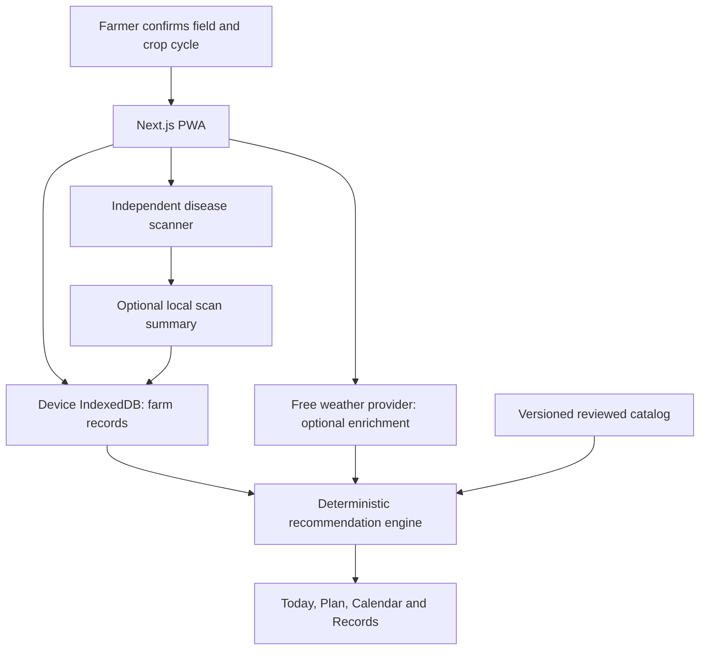

# Architecture: farm companion

Status: target design. Existing scanner code/model integration must be inspected before migration; this document does not claim the companion is deployed. See [full build plan](farm-companion/BUILD_PLAN.md).

## Local-first runtime

Keep the existing Next.js app. Add feature modules, pure domain services, browser storage and typed provider adapters incrementally. Core records/catalog/calendar do not require accounts, Supabase or server inference. No paid AI or API dependencies. External provider failures remain isolated.

Weather uses explicit field consent, direct browser requests where supported, normalized units, source/observation/fetch time and conservative cache/timeout behavior. Requesting weather sends coordinates to that provider; explain this at consent. Manual field/region/skip alternatives remain available. Do not infer the field from phone location without confirmation.

Soil is entered from measured reports first. Regional maps are optional background; no dependency on the paused SoilGrids REST service or farm-level suitability claims. Sensors require actual existing hardware and authenticated integration; never label modelled weather/soil as live telemetry.

## Storage and boundaries

IndexedDB retains confirmed region, crop cycles, tasks, observations, measured soil values, expenses and harvests locally. Precise coordinates remain transient by default, with independent opt-in local retention. Images are neither logged nor retained by default. Persisting a photo or uploading it for hosted inference requires explicit consent. Export/import/delete and migrations are core features; anonymous server metadata is not required.

The recommendations engine consumes immutable versioned snapshots and only reviewed catalog entries. It returns actions/candidates plus evidence and abstention reasons. Source type, crop/stage/region, soil-test depth, units and freshness constrain applicability. No yield guarantees or pesticide/fertilizer prescriptions. See [engine](farm-companion/RECOMMENDATION_ENGINE.md) and [data model](farm-companion/DATA_MODEL.md).

## Scanner and model contract

Preserve the existing disease work. Choose inference mode from actual bundle size/device performance and zero-cost deployment feasibility:

- Browser ONNX is the preferred long-term privacy/offline path, gated by evaluated model and device tests.
- Existing hosted/local FastAPI inference may remain an optional path only when genuinely available at zero cost; no mandatory paid host.
- No reachable/usable evaluated model means an unavailable result, never a fabricated diagnosis. Synthetic demonstration is separate and visibly labelled.

A versioned bundle declares model.onnx, labels.json and metadata.json: input shape, normalization, model/dataset versions, validation-derived confidence threshold and metrics report. Never infer preprocessing from filenames. Softmax confidence is not diagnostic certainty; uncertain/unsupported cases remain explicit. Field-image evaluation and real held-out test images are required; synthetic data must not enter evaluation.

## Free distribution and deployment

Core app must run locally. Retain existing free hosting if currently eligible; investigate static export/GitHub Pages when routes and browser inference support it. Static hosting cannot run FastAPI or Next.js server routes. No paid databases, map APIs, LLM calls, SMS or WhatsApp. Maintain a local release bundle and cached/demo fallback. Final hosting choice, scanner feasibility and exhibition devices are M5 gates, not assumed completed.

See [repository/delivery protocol](farm-companion/DELIVERY.md) for layout, team paths, checks, provider budgets and release behavior.
